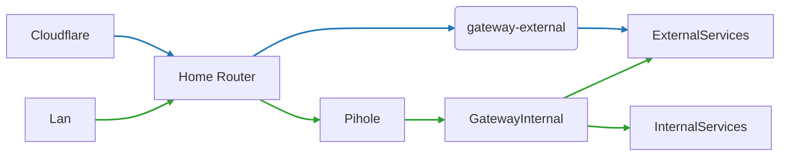

# k8s-gitops

## :loudspeaker:&nbsp; About

This repository contains my entire Kubernetes cluster setup built on K3s and managed by Flux v2.\
Secrets are encrypted and managed with [SOPS](https://github.com/mozilla/sops).

See these manuals for an initial deployment:

- [Install pre-commit Hooks](./.github/docs/precommit.md)
- [Setting up GnuPG keys](./.github/docs/gpg.md)
- [Initial flux deployment](./.github/docs/flux.md)

## 🧰 Prerequisites

- `flux` command-line tools for bootstrap and reconciliation.
- `kubectl` configured against the target K3s cluster.
- `age`/GnuPG plus the SOPS configuration used for secrets.

---

## GitOps

[Flux](https://github.com/fluxcd/flux2) watches my cluster folder (see `Repository Structure` below) and makes the changes to my cluster based on the YAML manifests.

[Renovate](https://github.com/renovatebot/renovate) is a very useful tool that when configured will start to create PRs in your GitHub repository when Docker images, Helm charts or anything else that can be tracked has a newer version. The configuration for Renovate is located [here](./.github/renovate.json5)

There are also a couple GitHub workflows included in this repository that will help automate some processes. See [here](.github/workflows/README.md) for more information.

## :open_file_folder:&nbsp; Repository Structure

This Git Repository contains the following directories and are ordered below by how Flux will apply them:

- **cluster/flux** directory is where Flux deployments are located
- **cluster/crds** directory contains CustomResourceDefinitions that need to exist before anything else
- **cluster/apps** directory (depends on **crds**) is where common applications are located
- **cluster/networkpolicies** directory (depends on **cilium**) contains network policies

These directories are not tracked by Flux but are useful nonetheless:

- **.github** directory contains GitHub related files
- **.taskfiles** directory contains [go-task](https://github.com/go-task/task) related files
- **hack** directory contains useful scripts

---

## 🌐 DNS

### Gateways

Ports `80/443` forward to the two Envoy Gateway data planes: `gateway-internal` serves my home network plus services that need both internal and tightly scoped external access, whereas `gateway-external` is reserved for fully public workloads. Cloudflare fronts the external Gateway, and dedicated Cilium network policies only permit traffic originating from Cloudflare's published ranges; everything else is dropped before it reaches Envoy. The external Gateway also blocks admin portals and direct login endpoints so only sanctioned entry points reach the services, and my router port-forwards the public ports to `gateway-external` while internal-only traffic stays within `gateway-internal`.

- `gateway-internal`: LAN access, internal workloads, and hybrid services exposed through Pi-hole's dnsmasq.
- `gateway-external`: Cloudflare-facing public endpoints, owner-managed blocks on sensitive admin traffic, and router port-forwards for the internet.

### Internal DNS

Internal DNS relies on the built-in [dnsmasq](https://thekelleys.org.uk/dnsmasq/doc.html) of [pihole](https://pi-hole.net) deployed on a raspberry pi, which forwards every lookup to `gateway-internal` so internal applications are reachable only via the internal gateway. Pi-hole also handles ad blocking.

### External DNS

[cloudflare-operator](https://github.com/containeroo/cloudflare-operator) is deployed in my cluster and ingresses with the annotation `cloudflare-operator.io/type=CNAME` and `cloudflare-operator.io/content=${BASE_DOMAIN}` will be synced with [Cloudflare](https://www.cloudflare.com/).

### Dynamic DNS

[cloudflare-operator](https://github.com/containeroo/cloudflare-operator) syncs also my external IPv4 address with [Cloudflare](https://www.cloudflare.com/).

---

## :hugs:&nbsp; Thanks

Huge thanks to the community at [k8s@home](https://github.com/k8s-at-home) for the awesome templates and the Kubernetes at home logo!
