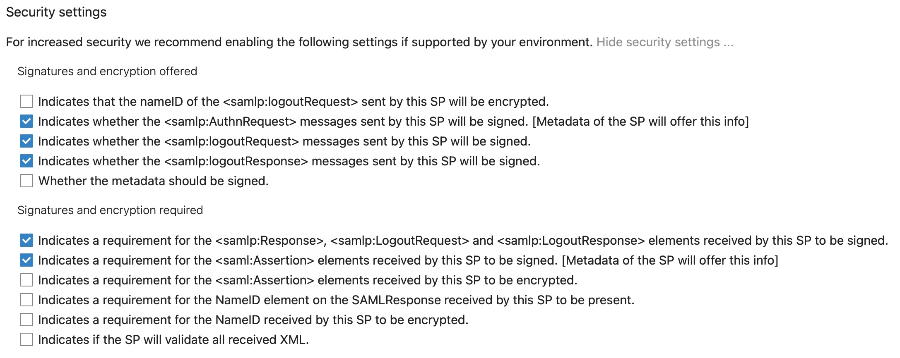

# Nextcloud SAML configuration

## setup

install app `SSO & SAML authentication`

## configuration

### nextcloud (part 1)

goto `Settings` --> `Administration` --> `SSO & SAML authentication`  

set `Global settings`:  
check `Use SAML auth for the Nextcloud desktop clients (requires user re-authentication)`  
Attribute to map the UID to --> `username`  
Optional display nam of the identity provider --> `SSO`  
Identifier of the Idp Entry --> `https://sso.${BASE_DOMAIN}/auth/realms/master`  
URL Target of the IdP where the SP will send the Autentification Request Message --> `https://sso.${BASE_DOMAIN}/auth/realms/master/protocol/saml`  
URL Location of the IdP where the SP will needs the SLO Request --> `https://sso.${BASE_DOMAIN}/auth/realms/master/protocol/saml`  
Public X.509 certificate of the Idp --> Keycloak --> `Realm Setting` --> `Keys` --> `Certificate`  

__Attribute mapping__  
Attribute to map the displayname to --> `username`  
Attribute to map the email address to --> `email`  
Attribute to map the quota to --> `nextcloudquota`  
click on `Download metadata XML`

### keycloak

goto `Clients` --> `Create`  
Import `metadata.xml`  

__settings:__  
define a `Name`  
Include AuthnStatement --> `ON`  
Sign Documents --> `ON`  
Sign Assertions --> `ON`  
Signature Alogrithm --> `RSA_SCH256`  
SAML Signature Key Name --> `KEY_ID`  
Canonicalization Method --> `Exclusive`  
Client Signature Required --> `ON`  
Force Post Binding --> `ON`  
Front Channel Logout --> `ON`  
Name ID Format --> `username`  
Valid Redirect URIs --> `https://cloud.${BASE_DOMAIN}/*`  
Master SAML Processing URL --> `https://sso.${BASE_DOMAIN}/auth/realms/master`  
Fine Grain SAML Endpoint Configuration --> Assertion Consumer Service POST Binding URL --> `https://cloud.${BASE_DOMAIN}/apps/user_saml/saml/acs`  
Fine Grain SAML Endpoint Configuration --> Logout Service POST Binding URL --> `https://cloud.${BASE_DOMAIN}/apps/user_saml/saml/sls`  
Fine Grain SAML Endpoint Configuration --> Logout Service Redirect Binding URL --> `https://cloud.${BASE_DOMAIN}/apps/user_saml/saml/sls`  

create following Protocol Mapper:

* email  
    Name --> `email`  
    Mapper Type --> `User Property`  
    Property --> `email`  
    Friendly Name --> `email`  
    SAML Attribute Name --> `email`  
    SAML Attribute NameFormat --> `Basic`
* last name  
    Name --> `nextcloudquota`  
    Mapper Type --> `User Property`  
    Property --> `nextcloudquota`  
    Friendly Name --> `nextcloudquota`  
    SAML Attribute Name --> `nextcloudquota`  
    SAML Attribute NameFormat --> `Basic`  
* roles  
    Name --> `roles`  
    Mapper Type --> `Role list`  
    Role attribute name --> `roles`  
    Friendly Name -->`roles`  
    SAML Attribute NameFormat --> `Basic`  
    Single Role Attribute --> `ON`
* name  
    Name --> `username`  
    Mapper Type --> `User Property`  
    Property --> `username`  
    Friendly Name --> `username`  
    SAML Attribute Name --> `username`  
    SAML Attribute NameFormat --> `Basic`

Configure --> Clinet Scopes --> role_list --> tab `Mappers` --> click on `edit` --> `Single Role Attribute` --> `ON`

### nextcloud (part 2)

__Service Provider Data__  
`X.509 certificate of the Service Provider` = `Keycloak` --> `Clients` --> `Nextcloud` --> `SAML Key` --> `Certificate`  
`Private key of the Service Provider` = `Keycloak` --> `Clients` --> `Nextcloud` --> `SAML Key` --> `Private Key`

__Security settings__

*Signatures and encryption offered*  
Indicates whether the `<samlp:AuthnRequest>` messages sent by this SP will be signed. [Metadata of the SP will offer this info] --> `ON`  
Indicates whether the `<samlp:logoutRequest>` messages sent by this SP will be signed --> `ON`  
Indicates whether the `<samlp:logoutResponse>` messages sent by this SP will be signed. --> `ON`

*Signatures and encryption required*  
Indicates a requirement for the `<samlp:Response>`, `<samlp:LogoutRequest>` and `<samlp:LogoutResponse>` elements received by this SP to be signed. --> `ON`  
Indicates a requirement for the `<saml:Assertion>` elements received by this SP to be signed. [Metadata of the SP will offer this info] --> `ON`
