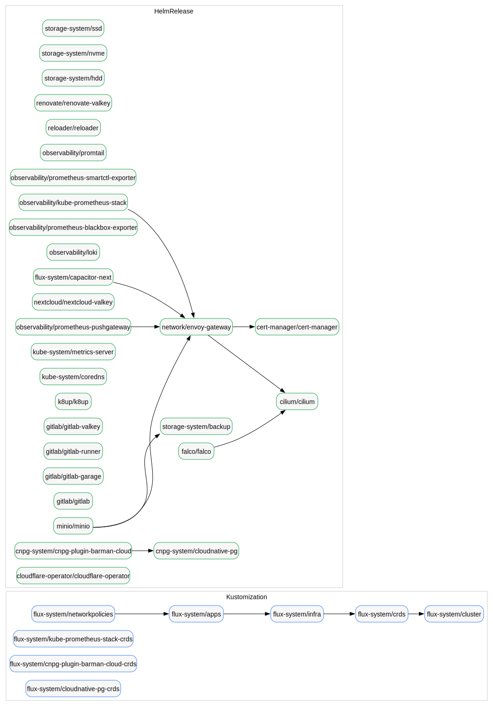

# Flux Dependency Graph

Generated by `hack/check_flux_dependencies.py`.

Regenerate:

```bash
python3 ./hack/check_flux_dependencies.py --check \
  --write-dot cluster/flux/dependencies.dot \
  --write-svg cluster/flux/dependencies.svg \
  --write-readme cluster/flux/DEPENDENCIES.md
```

- DOT source: `dependencies.dot`
- Rendered graph: `dependencies.svg`



- Total Flux resources: **37**
- Kustomization dependsOn edges: **4**
- HelmRelease dependsOn edges: **9**

### Kustomization edges

- `flux-system/apps` -> `flux-system/infra`
- `flux-system/crds` -> `flux-system/cluster`
- `flux-system/infra` -> `flux-system/crds`
- `flux-system/networkpolicies` -> `flux-system/apps`

### HelmRelease edges

- `cnpg-system/cnpg-plugin-barman-cloud` -> `cnpg-system/cloudnative-pg`
- `falco/falco` -> `cilium/cilium`
- `flux-system/capacitor-next` -> `network/envoy-gateway`
- `minio/minio` -> `network/envoy-gateway`
- `minio/minio` -> `storage-system/backup`
- `network/envoy-gateway` -> `cert-manager/cert-manager`
- `network/envoy-gateway` -> `cilium/cilium`
- `observability/kube-prometheus-stack` -> `network/envoy-gateway`
- `observability/prometheus-pushgateway` -> `network/envoy-gateway`
